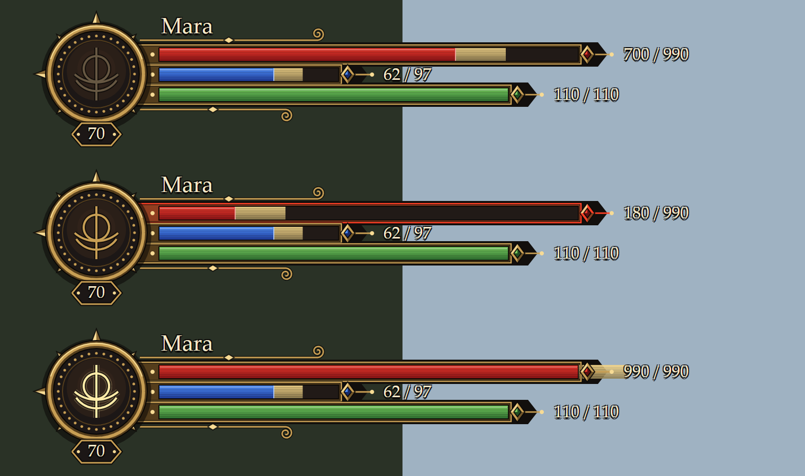

# Elden Ring Status Bars

A native DLL for Elden Ring 1.17.1 (`eldenring.exe` 2.7.1.0) that redraws the player's HP, FP and stamina panel in an ornate dark fantasy style: aged gold on warm black, with bright fills that stay readable.



The picture is rendered by the test in `src/panel.rs` from the same shapes the mod draws, over a dark and a bright background. It is not a game screenshot, and the font differs from the one used in the game.

- three bars in gold frames with red, blue and green gradient fills; the part just lost stays visible in pale gold for a moment and then shrinks;
- a gold lozenge with a stone of the bar's colour at the end of each bar;
- current and maximum values next to each bar;
- the character name above the bars, between two thin gold rules that end in scrolls;
- a round medallion on the left in a beaded gold ring with a star of points behind it. The sign inside is dim bronze without a Great Rune, gold with one equipped, and bright with a glow while a Rune Arc is active;
- the character level on a pointed plaque under the medallion;
- the frame of the HP bar turns red below a quarter of the maximum.

The mod changes no game files. It draws over the game's own bars and covers them with a dark plate.

> Status: version 0.2.0 is built and its tests pass, but the new look has not been seen in the game yet. Version 0.1.0 ran in the game with The Convergence and Seamless Co-op (loading, real values, the level). Not confirmed: the 0.2.0 look, the panel coming in without a delay, hiding in menus, the sign with a Great Rune equipped, cutscenes, resolutions other than 1920x1080. See "Known limits".

## Install

The mod is loaded as a native by [me3](https://github.com/garyttierney/me3) or by Mod Engine 2.

1. Copy `release/er_status_bars.dll` next to your other native mods, for example `mod/dll/`.
2. Add it to the profile.

   me3 (`*.me3`):

   ```toml
   [[natives]]
   path = './../mod/dll/er_status_bars.dll'
   ```

   Mod Engine 2 (`config_eldenring.toml`):

   ```toml
   external_dlls = ["mod/dll/er_status_bars.dll"]
   ```

3. Start the game offline or through Seamless Co-op. Do not use the mod with Easy Anti-Cheat enabled.

On the first start the mod writes `er_status_bars.ini` and `er_status_bars.log` next to the DLL. There are no hotkeys and no settings window.

## Settings

`er_status_bars.ini` is re-read while the game runs, about a second after you save it. Lengths are in pixels of a 1920x1080 picture and scale with the resolution.

| Section | Key | Meaning |
|---|---|---|
| `[Panel]` | `Enabled` | Turn the panel off without removing the mod |
| | `Scale` | Panel size, 0.5 to 3 |
| | `OffsetX`, `OffsetY` | Shift of the panel |
| | `Opacity` | 0.1 to 1 |
| | `Backing` | Dark plate behind the bars. It is what hides the game's own bars |
| | `ShowName`, `ShowNumbers`, `ShowLevel` | Name, values, level plate |
| | `ShowDelay` | Seconds the game's interface has to stay up before the panel comes in, 0 to 10. 0 by default, so the panel covers the game's bars as soon as they appear |
| | `HideDuringFade` | Keep the panel away while the game fades the screen. Set to 0 if the panel never appears |
| | `HideInMenus` | Hide the panel while a game menu or a popup is open. Set to 0 if the panel goes missing during play |
| `[Bars]` | `HpPixelsPerPoint`, `FpPixelsPerPoint`, `StaminaPixelsPerPoint` | Bar length per point of the maximum value |
| | `MinLength`, `MaxLength` | Limits of the bar length |
| `[Debug]` | `Log` | Write `er_status_bars.log` |

If a game bar shows from under the panel on the right, raise the matching `PixelsPerPoint` value.

## How it works

A recurring game task reads the player's values from the game structures ([fromsoftware-rs](https://github.com/vswarte/fromsoftware-rs)): HP, FP, stamina, name, level, the Great Rune slot and the Rune Arc flag. An ImGui overlay on the DirectX 12 swap chain ([hudhook](https://github.com/veeenu/hudhook)) draws the panel from plain shapes, without textures.

The panel is shown when there is a player character, the game's interface is in its plain play state (no menu, no popup) and no fade plate covers the screen. It then waits `ShowDelay` seconds (0 by default) and comes in within a few frames; it leaves as fast when any of the three stops being true. There is no player character on the title screen, so the panel cannot appear there.

## Known limits

- The game's own bars are covered, not removed. A bar longer than the panel's shows from under it; tune `[Bars]`.
- Positions follow the default interface layout at 16:9. On ultrawide the panel is shifted like the game's interface, which has not been tried.
- The sign in the medallion is the mod's own drawing and is the same for every Great Rune. Its gold and lit states have not been seen in the game yet.
- Status effect icons, buffs and the boss bar are left to the game.
- Several overlays hooking the same swap chain can conflict. This mod and [er_ping_marker](https://github.com/DarkSailas/EldenRing-PingMarker) take turns at start through a named mutex; mods that do not know about it may still collide. If the game does not start with this DLL, remove it from the profile and check the log.
- Built for 1.17.1. Other game versions may shift the structures the mod reads.

## Build

Rust with the `x86_64-pc-windows-gnu` toolchain and MinGW-w64 on `PATH`:

```
cargo test --release
cargo build --release
```

The DLL appears in `target/x86_64-pc-windows-gnu/release/`. `.cargo/config.toml` links the C++ runtime statically, so the DLL needs nothing beyond system libraries.

## License

MIT, see `LICENSE`.

---

# Панель здоровья, маны и выносливости (по-русски)

Нативная DLL для Elden Ring 1.17.1. Перерисовывает панель игрока в нарядном стиле тёмного фэнтези: состаренное золото на тёплом чёрном, заливки яркие и читаются на любом фоне.

- три полосы в золотых рамках с красной, синей и зелёной заливкой; потерянная часть на мгновение остаётся видна бледным золотом и затем убывает;
- на конце каждой полосы — золотой ромб с камнем цвета полосы;
- текущее и максимальное значение рядом с каждой полосой;
- имя персонажа над полосами, между двумя тонкими золотыми линиями с завитками;
- круглый медальон слева в золотом кольце с бусинами и лучами. Знак внутри тусклый без Великой руны, золотой с надетой руной и светится, пока действует Рунная дуга;
- уровень персонажа на плашке под медальоном;
- рамка полосы здоровья краснеет, когда остаётся меньше четверти.

Картинка вверху страницы нарисована тестом из тех же фигур, что рисует мод; это не снимок из игры, шрифт в игре другой.

Файлы игры мод не меняет: он рисует поверх штатных полос и закрывает их тёмной подложкой.

> Состояние: версия 0.2.0 собрана, тесты проходят, но новый вид в игре ещё не смотрели. Версия 0.1.0 работала в игре с The Convergence и Seamless Co-op. Не подтверждено: вид 0.2.0, появление панели без задержки, скрытие в меню, знак с надетой Великой руной, ролики и разрешения, отличные от 1920x1080.

## Установка

1. Скопируйте `release/er_status_bars.dll` к остальным нативным модам, например в `mod/dll/`.
2. Добавьте в профиль me3:

   ```toml
   [[natives]]
   path = './../mod/dll/er_status_bars.dll'
   ```

3. Запускайте игру без Easy Anti-Cheat: офлайн или через Seamless Co-op.

При первом запуске рядом с DLL появятся `er_status_bars.ini` и `er_status_bars.log`. Горячих клавиш и окна настроек у мода нет.

## Настройки

Файл `er_status_bars.ini` перечитывается на ходу, примерно через секунду после сохранения. Длины заданы в пикселях картинки 1920x1080.

- `Scale`, `OffsetX`, `OffsetY`, `Opacity` — размер, сдвиг и прозрачность панели.
- `Backing` — подложка, которая закрывает штатные полосы.
- `ShowName`, `ShowNumbers`, `ShowLevel` — имя, числа, уровень.
- `ShowDelay` — сколько секунд интерфейс игры должен быть на экране, прежде чем появится панель. По умолчанию 0: панель закрывает штатные полосы сразу.
- `HideDuringFade` — прятать панель, пока игра затемняет экран. Поставьте 0, если панель не появляется совсем.
- `HideInMenus` — прятать панель, пока открыто меню игры или всплывающее окно. Поставьте 0, если панель пропадает во время игры.
- `HpPixelsPerPoint`, `FpPixelsPerPoint`, `StaminaPixelsPerPoint`, `MinLength`, `MaxLength` — длина полос. Если штатная полоса торчит из-под панели справа, увеличьте соответствующее значение.

Панель видна только в самой игре: на титульном экране персонажа ещё нет, в меню и на экранах загрузки она скрыта.

## Ограничения

- Штатные полосы закрыты, а не убраны. Полоса длиннее панельной видна из-под неё.
- Расположение рассчитано на обычный интерфейс 16:9; на сверхшироких экранах не проверялось.
- Знак в медальоне нарисован самим модом и одинаков для всех Великих рун. Золотым и светящимся его в игре пока не видели.
- Значки эффектов и полосу босса рисует игра.
- Несколько оверлеев на одной цепочке кадров могут конфликтовать. Если игра не запускается, уберите DLL из профиля и посмотрите лог.
